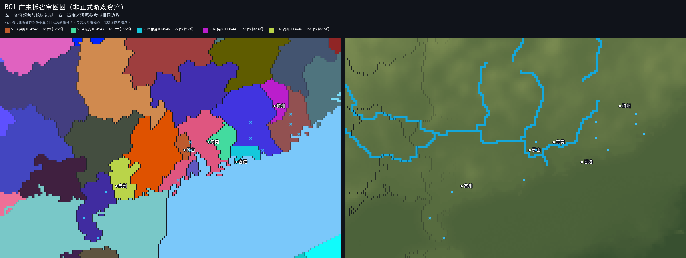

# B01 广东拆省审图记录

## 状态

**第二版地理重绘已经写入模组正式资产，并通过生产级静态校验。**

本批次在 EU4 1.37.5 原版 `provinces.bmp` 上以内存方式拆分佛山、东莞、香港、
梅州和高州。第二版废弃了早期机械切线：佛山和东莞改为珠三角局部块状省，
梅州改到潮州西北内陆，香港加入东莞东南、惠州南缘的海岸。

广州继续使用省份 ID `667`，现有贸易效率修正、城市、港口与南海神庙不迁移。
流水线先在本地 `build/map/B01/provinces.bmp` 生成 staging 候选图，再把同一
像素结果部署到 `guangdong_independent_practice/map/provinces.bmp`。正式图以
BMP、`5632 × 2048`、24 位 RGB 重新打开及逐像素比对通过。

审图图：

## 冻结分配

| 设计键 | 新省 | 母省 | 游戏 ID | RGB | 发展度 | 像素占母省 | 沿海 |
|---|---|---:|---:|---|---:|---:|---|
| S-13 | 佛山 | 667 广州 | 4942 | 190, 91, 45 | 4/4/1 | 73 / 596（12.2%） | 否 |
| S-14 | 东莞 | 2157 惠州 | 4943 | 67, 219, 159 | 3/3/1 | 151 / 947（15.9%） | 是 |
| S-19 | 香港 | 2157 惠州 | 4946 | 20, 200, 220 | 1/1/1 | 92 / 947（9.7%） | 是 |
| S-15 | 梅州 | 2156 潮州 | 4944 | 187, 30, 204 | 2/2/1 | 166 / 512（32.4%） | 否 |
| S-16 | 高州 | 2159 雷州 | 4945 | 186, 212, 73 | 1/1/1 | 228 / 607（37.6%） | 是 |

惠州母省改为一次性三向拆分，逐项保持原发展度 `7/7/3`：

| 省份 | 税收 | 生产 | 人力 | 总发展度 |
|---|---:|---:|---:|---:|
| 惠州 2157 | 3 | 3 | 1 | 7 |
| 东莞 4943 | 3 | 3 | 1 | 7 |
| 香港 4946 | 1 | 1 | 1 | 3 |
| **合计** | **7** | **7** | **3** | **17** |

香港在 1444 年只是低发展度的屯门锚地、渔盐聚落与海防节点，不直接套用现代
国际都会的经济规模。正式历史使用粤国所有、广府文化、儒教、鱼类贸易品和丘陵
地形，并为后续海贸事件保留发展空间。

地形覆盖采用佛山、东莞为农田，梅州、高州、香港为丘陵；五省继承正常季风，
高州另继承雷州的热带气候。

## 地理修订

- **佛山**：缩为广州正西侧的紧凑内陆块，不再贯穿广州南北；广州资产锚点锁定。
- **东莞**：位于广州以东、惠州西南，只占珠江口西南块，不再向韶关或赣州方向北伸。
- **香港**：位于东莞东南、惠州南缘，以新界—九龙沿岸作可点击抽象；不把海水改成陆地。
- **梅州**：位于潮州西北内陆，只接赣州、汀州、惠州和潮州，不再接厦门或海区。
- **高州**：维持雷州半岛根部方案，雷州继续掌握琼州海峡门户。

原版像素尺度无法同时精确表达香港岛、九龙和新界。当前方案优先保证香港处于
珠江口东侧、东莞以南并拥有独立海岸；若要描绘真实岛形，必须连带修改
`heightmap.bmp`、海岸和地形，本轮不做。

## 已通过的门槛

- 五个新 ID 紧接原版最高 ID `4941`，构成连续区间 `4942–4946`。
- 五个 RGB 均唯一，且不与原版定义表冲突。
- 全图共有 710 个变化像素，全部来自指定的四个母省。
- 惠州—东莞—香港作为同一个三向分区一次生成，遮罩互斥且像素严格守恒。
- 五个新省各有单一四向连通块和至少一个 `3 × 3` 实心可点击核心。
- 四个母省主陆块仍为单一连通块，原有离岛不被新省吞并。
- 新省与母省分别保留 26、20、18、30、17 条四向公共像素边。
- 东莞与香港共享 6 条四向边，二者各自拥有独立海岸。
- 最终邻接白名单、沿海属性及拆分前后的外部邻接血统均一致。
- 广州 `667`、南海神庙、广州贸易修正和雷州—海南特殊海峡端点不变。
- 原版海岸线、外部省界、河流和高度图不修改。

机器报告见
[`previews/B01_guangdong_report.json`](previews/B01_guangdong_report.json)，
原始最近邻像素图见
[`previews/B01_guangdong_pixels.png`](previews/B01_guangdong_pixels.png)。

## 正式实现

下列资产现已部署：

1. 完整 `map/provinces.bmp`、`definition.csv` 与 `default.map`，游戏上限为 `4947`。
2. 五个新省的城市、文字、单位与港口点，以及迁移后的惠州点位。
3. 珠江三角洲 Area、东广东与西广东成员，以及 Region、洲、气候和地形。
4. 广州贸易节点和南中国贸易公司的五省成员。
5. 五个新省历史、四个母省发展度回调及中文本地化。

生产构建报告见
[`previews/B01_mod_build_report.json`](previews/B01_mod_build_report.json)，静态验证
报告见
[`previews/B01_mod_validation_report.json`](previews/B01_mod_validation_report.json)。

尚余最后一层实机检查：以全新1444年存档进入游戏，查看 `map.log`、`error.log`、
地图模式、寻路、港口模型以及保存/读取。静态通过不能代替引擎启动测试。
