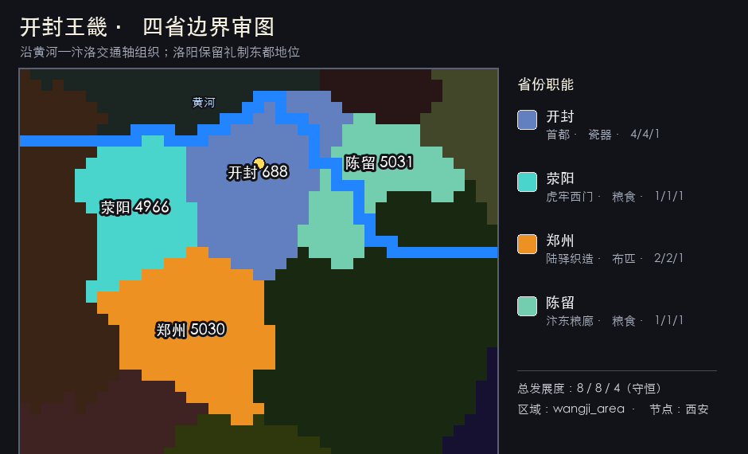

# B03 开封王畿细化方案

## 定案

本批把开封母省拆为开封、荥阳、郑州、陈留四省，并组成 `wangji_area`。B14 河南细化随后把周王直辖范围扩展为东京王畿与成周区域共八省；开封称“东京”，洛阳称“成周”。完整定案见 [B14 河南二十一省与周王双京](07_b14_henan_detail.md)。

曾测试加入杞县的五省方案，但东南部分面积过小、边界狭长，会损害地图辨识度。四省方案能保持边界舒展、每省连续，并让黄河、虎牢通道和汴东走廊共同决定轮廓。

## 省份规格

| ID | 省份 | 地形 | 商品 | 发展度 | 地图与玩法职能 |
|---:|---|---|---|---:|---|
| 688 | 开封 | 农田 | 瓷器 | 7/9/3 | 周王朝东京、二级贸易中心、王会与行政中枢 |
| 4966 | 荥阳 | 丘陵 | 谷物 | 3/3/2 | 王畿西门，控制虎牢—成周方向 |
| 5030 | 郑州 | 农田 | 布匹 | 5/6/2 | 南北陆驿、织造与粮布集散地 |
| 5031 | 陈留 | 农田 | 谷物 | 4/5/1 | 汴东粮廊，连接商宋、睢水与济水故道方向 |

东京王畿现为 `19/23/8`，总计50；与成周区域合计93发展度。数值提升是河南整体重平衡的一部分，让中等规模诸侯开局接近一百发展度，而不是继续遵守早期守恒方案。

## 边界逻辑

- 北界依黄河，形成清晰而自然的王畿外缘。
- 荥阳在西侧收窄，表现嵩山余脉、虎牢关和河洛门户。
- 郑州向南展开，覆盖平原交通汇合处，避免四省机械等分。
- 开封占据中部与黄河南岸核心，保持首都在视觉上的中心性。
- 陈留沿东侧水陆走廊舒展，成为王畿通往商宋和淮泗方向的出口。

## 区域与贸易

- 区域：`wangji_area`
- 大区：`north_china_region`
- 贸易节点：西安节点
- 贸易公司归属：西安贸易公司
- 主要贸易流：洛阳／关中—荥阳—开封—陈留—商宋与淮泗

开封的瓷器代表王室官作、礼器与高价值城市消费；郑州的布匹表现陆路集散和手工业；荥阳、陈留的谷物让王畿财政依赖黄河平原与漕运，也为围城和灾荒事件留下空间。

## 后续国家实现

本批已完成地图、省份历史、区域、地形、贸易、气候、位置与本地化资产。当前仓库尚无周国国家标签，因此省份历史暂沿用原版明朝所有权以保持启动合法；建立周国标签时，应一次性完成：

1. 新建周国标签、旗帜、颜色、政府与本地化；
2. 将东京王畿与成周区域八省的1444年所有者和核心改为周国；
3. 在周国历史中设置 `capital = 688`；
4. 为开封增加防吞并、王会与礼统事件；
5. 为成周洛阳增加宗庙、旧盟坛与礼制中心修正。

## 审图

