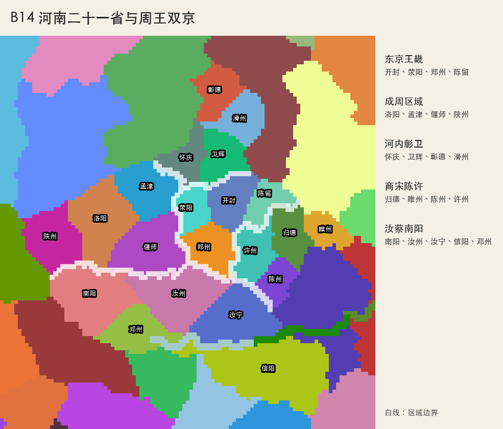

# B14 河南二十一省与周王双京

## 定案

河南细化为二十一省、五个区域。周王直辖东京王畿与成周区域共八省；开封是1444年
行政首都“东京”，洛阳以“成周”之名保留宗庙、盟坛与礼制中心地位。洛阳不是单省
区域，而是与孟津、偃师、陕州共同构成独立的 `chengzhou_area`，游戏显示名为
“成周区域”。

周室第一次由丰镐东迁成周；洛阳再盟恢复河洛王畿后，又在十五世纪初由成周东迁
开封，因此称“再次东迁”。东京负责常朝、财政和军政，成周负责宗庙、礼统和盟约。

## 区域与省份

| 区域 | 省份 | 总发展度 | 推荐政治归属 |
|---|---|---:|---|
| 东京王畿 | 开封、荥阳、郑州、陈留 | 50 | 周王直辖 |
| 成周区域 | 洛阳、孟津、偃师、陕州 | 43 | 周王直辖 |
| 河内彰卫 | 怀庆、卫辉、彰德、滑州 | 40 | 魏、赵分据 |
| 商宋陈许 | 归德、睢州、陈州、许州 | 42 | 商宋为主 |
| 汝蔡南阳 | 南阳、汝州、汝宁、信阳、邓州 | 54 | 蔡、申分据 |

全河南发展度为 `89/97/43`，总计229。周王双京为 `35/40/18`，总计93，达到中等
诸侯约一百发展度的目标，但被虎牢、黄河、崤函与淮河分割，防守压力仍然明显。

## 商品与地形

| ID | 省份 | 区域 | 地形 | 商品 | 发展度 |
|---:|---|---|---|---|---:|
| 688 | 开封 | 东京王畿 | 农田 | 瓷器 | 7/9/3 |
| 4966 | 荥阳 | 东京王畿 | 丘陵 | 谷物 | 3/3/2 |
| 5030 | 郑州 | 东京王畿 | 农田 | 布匹 | 5/6/2 |
| 5031 | 陈留 | 东京王畿 | 农田 | 谷物 | 4/5/1 |
| 1836 | 洛阳 | 成周区域 | 农田 | 布匹 | 7/7/4 |
| 5045 | 孟津 | 成周区域 | 农田 | 谷物 | 3/4/2 |
| 5046 | 偃师 | 成周区域 | 农田 | 瓷器 | 3/3/2 |
| 4967 | 陕州 | 成周区域 | 丘陵 | 铁矿 | 3/3/2 |
| 692 | 怀庆 | 河内彰卫 | 农田 | 谷物 | 4/4/2 |
| 5047 | 卫辉 | 河内彰卫 | 农田 | 谷物 | 4/4/2 |
| 5048 | 彰德 | 河内彰卫 | 丘陵 | 铁矿 | 5/5/2 |
| 5049 | 滑州 | 河内彰卫 | 农田 | 牲畜 | 3/4/1 |
| 2176 | 归德 | 商宋陈许 | 农田 | 布匹 | 5/6/2 |
| 5050 | 睢州 | 商宋陈许 | 农田 | 牲畜 | 3/3/1 |
| 5051 | 陈州 | 商宋陈许 | 农田 | 谷物 | 4/4/2 |
| 5052 | 许州 | 商宋陈许 | 农田 | 布匹 | 5/5/2 |
| 687 | 南阳 | 汝蔡南阳 | 农田 | 布匹 | 6/6/3 |
| 5053 | 汝州 | 汝蔡南阳 | 丘陵 | 铁矿 | 3/3/2 |
| 5054 | 汝宁 | 汝蔡南阳 | 农田 | 谷物 | 5/5/2 |
| 2175 | 信阳 | 汝蔡南阳 | 丘陵 | 茶叶 | 3/4/2 |
| 5055 | 邓州 | 汝蔡南阳 | 草原 | 牲畜 | 4/4/2 |

全省只设两个二级贸易中心：东京开封与成周洛阳。归德依靠省份发展度、市场和后续
国家修正表现商宋贸易，不增设第三个贸易中心。

## 边界与淮河

- 成周北界依黄河，内部沿伊洛河谷分出洛阳、孟津与偃师，陕州沿崤山向西收束。
- 东京与成周通过荥阳—虎牢—偃师走廊相连，未绘制机械直线。
- 黄河北岸四省沿太行山东麓、漳洹水系和黄河故道弯曲划分。
- 商宋四省沿睢水、颍水方向和旧府州格局划分。
- 南部五省利用伏牛山、南阳盆地、桐柏山和淮河形成自然边界。
- 淮河上游为汝州、邓州、汝宁和信阳配置沿岸港口；多条隐藏 `sea` 邻接允许陆军
  直接过河，并继续触发海峡渡口的 `-2` 战斗惩罚。

## 当前实现状态

当前国家标签尚未完成，因此新增河南省份暂以 `MNG` 保持开局合法；文档中的周、魏、
赵、商宋、蔡、申是后续国家落地时的推荐所有权。东京和成周均已配置二级贸易中心，
成周区域、本地化、地形、历史、位置、贸易归属和验证资产已经同步。

