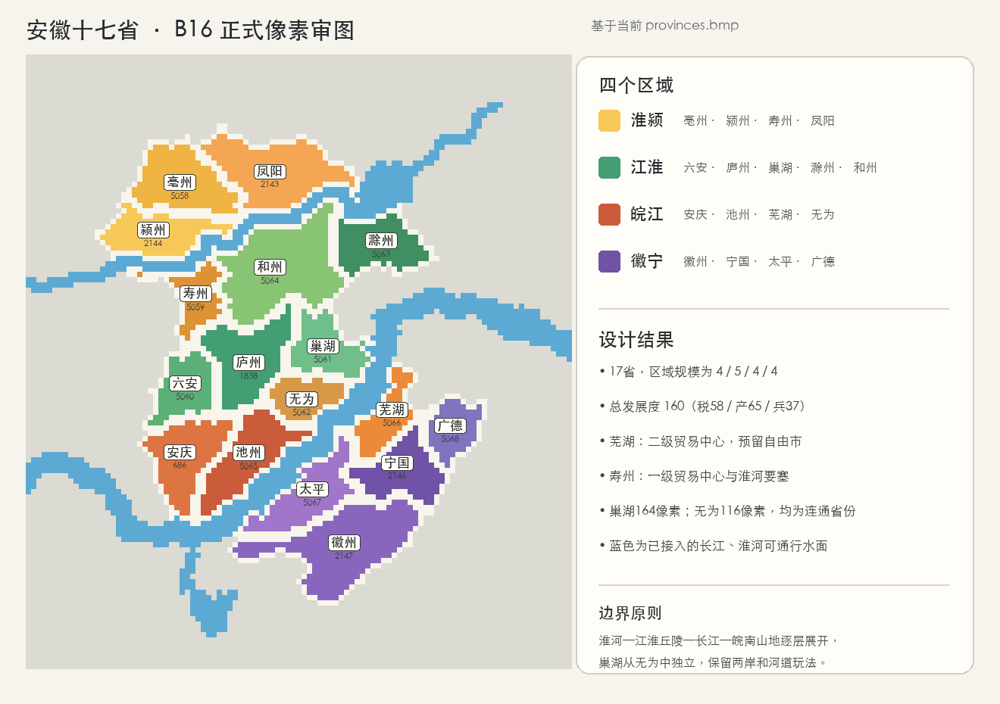

# B16 安徽十七省细化

## 定案

安徽细化为十七省、四个区域，区域显示名均为两个字：`淮颍`、`江淮`、`皖江`、
`徽宁`。边界从北向南依次利用淮北平原、淮河、江淮丘陵、巢湖—长江水网和皖南
山地展开。巢湖从无为中独立，形成庐州以东的湖运节点；无为仍保留为长江北岸的
圩田腹地，两省均是单一连通且可正常选取的省份。

全安徽发展度为 `58/65/37`，总计160。经济中心只设两个：芜湖为二级贸易中心并
预留自由市，寿州为一级贸易中心和淮河要塞；安庆另保留要塞，但不增设第三个贸易
中心。

## 区域与省份

| 区域 | 省份 | 数量 | 区域发展度 | 主要玩法 |
|---|---|---:|---:|---|
| 淮颍 | 亳州、颍州、寿州、濠州 | 4 | 42 | 淮北农业、寿春要塞、淮河商路 |
| 江淮 | 六安、庐州、巢湖、滁州、和州 | 5 | 43 | 大别山东口、巢湖水运、江宁西屏 |
| 皖江 | 安庆、池州、芜湖、无为 | 4 | 43 | 长江矿业商港、自由市竞争 |
| 徽宁 | 徽州、宁国、太平、广德 | 4 | 32 | 茶纸山货、吴越边境与山口防御 |

## 商品、地形与发展度

| ID | 省份 | 区域 | 地形 | 商品 | 发展度 | 特殊地位 |
|---:|---|---|---|---|---:|---|
| 5058 | 亳州 | 淮颍 | 农田 | 牲畜 | 3/3/2 | 淮北西北门户 |
| 2144 | 颍州 | 淮颍 | 农田 | 谷物 | 4/4/2 | 颍水—淮河集散地 |
| 5059 | 寿州 | 淮颍 | 农田 | 谷物 | 4/4/3 | 一级贸易中心、要塞 |
| 2143 | 濠州 | 淮颍 | 农田 | 谷物 | 3/3/2 | 淮河东段门户 |
| 5060 | 六安 | 江淮 | 丘陵 | 茶叶 | 3/3/3 | 大别山东麓军镇 |
| 1838 | 庐州 | 江淮 | 农田 | 布匹 | 4/5/2 | 江淮腹地中心 |
| 5061 | 巢湖 | 江淮 | 农田 | 鱼类 | 3/4/2 | 湖运和渔业节点 |
| 5063 | 滁州 | 江淮 | 丘陵 | 牲畜 | 3/3/2 | 江宁西北屏障 |
| 5064 | 和州 | 江淮 | 农田 | 谷物 | 3/3/2 | 江淮东部交通节点 |
| 686 | 安庆 | 皖江 | 丘陵 | 布匹 | 5/5/3 | 长江上游要塞 |
| 5065 | 池州 | 皖江 | 丘陵 | 铜矿 | 3/4/2 | 九华山矿业与山货 |
| 5066 | 芜湖 | 皖江 | 农田 | 铁矿 | 4/6/2 | 二级贸易中心、预留自由市 |
| 5062 | 无为 | 皖江 | 农田 | 谷物 | 3/3/2 | 长江北岸圩田粮仓 |
| 2147 | 徽州 | 徽宁 | 丘陵 | 纸张 | 4/5/2 | 徽商与山地手工业中心 |
| 2146 | 宁国 | 徽宁 | 丘陵 | 纸张 | 3/4/2 | 皖东南山地腹地 |
| 5067 | 太平 | 徽宁 | 丘陵 | 茶叶 | 3/3/2 | 黄山北麓山口 |
| 5068 | 广德 | 徽宁 | 丘陵 | 船具 | 3/3/2 | 天目山西缘竹木通道 |

## 河道、渡口与城市位置

- 颍州—寿州、濠州—和州和濠州—滁州通过淮河隐藏海峡邻接过河，保留直接通行和
  海峡渡口战斗惩罚。
- 安庆—太平、池州—无为和芜湖—巢湖通过长江河段建立对应渡口；河岸港口点已经
  落在各省真实接水像素上。
- 巢湖面积164像素，无为116像素；两者均为单一连通块，并分别接触长江河段。
- 全部十七省的城市、单位、文字和港口位置均已移入本省内部，港口逐像素验证接触
  正确河段。

## 实现与验收状态

正式几何已写入 `guangdong_independent_practice/map/provinces.bmp`，并同步完成
`definition.csv`、省份历史、区域、地区、地形、气候、贸易、位置、邻接和本地化。
当前新增编号为 `5058–5068`；既有安庆、庐州、濠州、颍州、宁国、徽州沿用原编号。

构建脚本可重复执行且不会反向覆盖手绘地图。完整静态验证已通过，当前最大省份号为
5068，`default.map` 的 `max_provinces` 为5069。仍建议在新游戏中复核自由市归属、
渡口战斗惩罚和芜湖贸易中心的实际表现。

